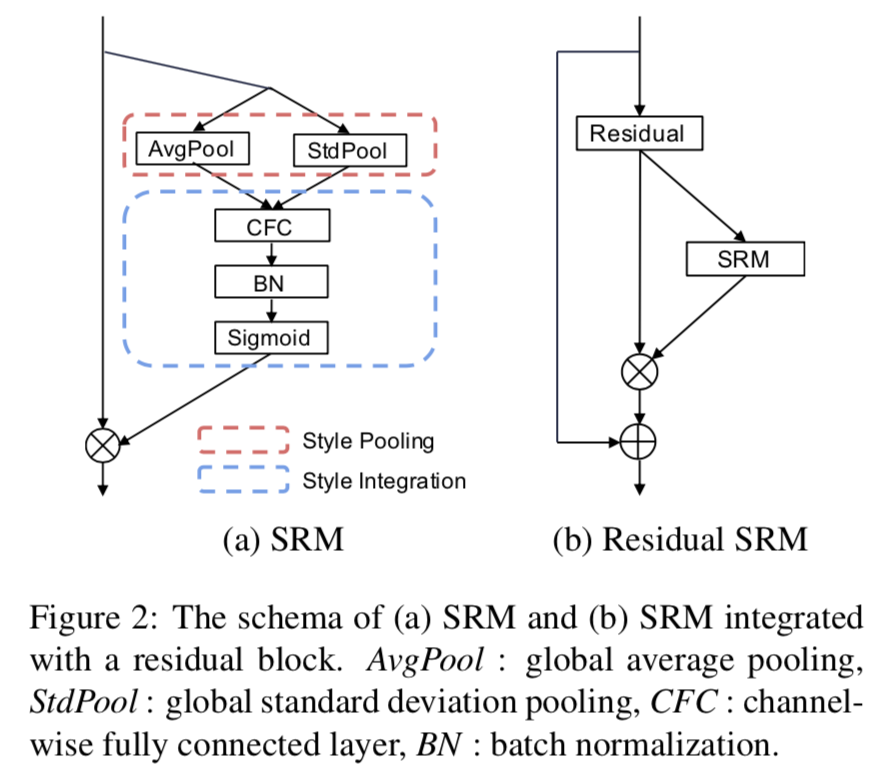
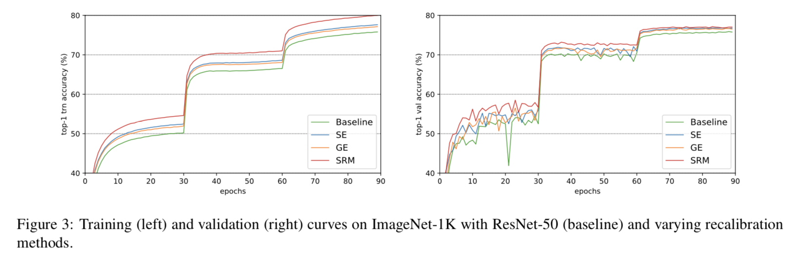
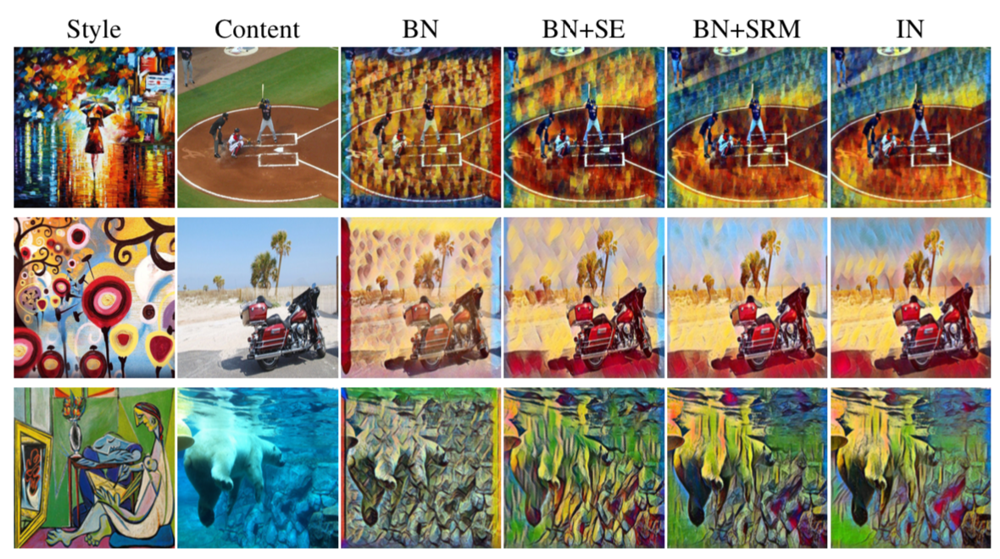

# SRM-Tensorflow
Simple Tensorflow implementation of "SRM : A Style-based Recalibration Module for Convolutional Neural Networks" | [paper](https://arxiv.org/abs/1903.10829)

<div align="center">
  
</div>

## Usage
```python
from SRM import SRM_block

x = SRM_block(x, channels, use_bias=False, is_training=is_training, scope='srm_block')

```

## Comparison


## Results
### Classification


### Style Transfer


### Reference
* [SRMNet-Pytorch](https://github.com/EvgenyKashin/SRMnet)

## Author
Junho Kim
